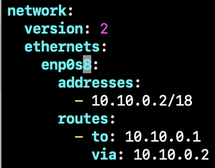

# Basic CI/CD

## Part 1. Настройка gitlab-runner

### Подними виртуальную машину Ubuntu Server 22.04 LTS.
Будь готов, что в конце проекта нужно будет сохранить дамп образа виртуальной машины.

### Скачай и установи на виртуальную машину gitlab-runner.


### Запусти gitlab-runner и зарегистрируй его для использования в текущем проекте (DO6_CICD).

- Для регистрации понадобятся URL и токен, которые можно получить на страничке задания на платформе.


## Part 2. Сборка

### Напиши этап для CI по сборке приложения из папки code-samples DO.
### В файле gitlab-ci.yml добавь этап запуска сборки через мейк файл из папки code-samples.
### Файлы, полученные после сборки (артефакты), сохрани в произвольную директорию со сроком хранения 30 дней.

```yml
stages:
  - build

build-job:
  stage: build
  script:
    - sudo apt-get update && sudo apt-get install -y gcc make
    - cd code-samples
    - make
  artifacts:
  paths: - code-samples/DO
  expire_in: 30 days
```


## Part 3. Тест кодстайла

### Напиши этап для CI, который запускает скрипт кодстайла (clang-format).
### Если кодстайл не прошел, то «зафейли» пайплайн.
### В пайплайне отобрази вывод утилиты clang-format.

```yml
stages:
  - build
  - code-style

build-job:
  stage: build
  script:
    - cd src/code
    - make
  artifacts:
    paths:
      - src/code/build/DO
    expire_in: 30 days

style-job:
  stage: code-style
  script:
    - clang-format -n src/code/main.c
```

## Part 4. Интеграционные тесты

### Напиши этап для CI, который запустит интеграционные тесты.

Для проекта из папки code-samples напиши интеграционные тесты самостоятельно. Тесты могут быть написаны на любом языке (c, bash, python и т.д.) и должны вызывать собранное приложение для проверки его работоспособности на разных случаях.

### Запусти этот этап автоматически только при условии, если сборка и тест кодстайла прошли успешно.

### Если тесты не прошли, то «зафейли» пайплайн.

### В пайплайне отобрази вывод, что интеграционные тесты успешно прошли / провалились.

```yml
stages:
  - build
  - code-style
  - test

build-job:
  stage: build
  script:
    - cd src/code
    - make
  artifacts:
    paths:
      - src/code/build/DO
    expire_in: 30 days

style-job:
  stage: code-style
  script:
    - clang-format -n src/code/main.c
  
test-job:
  stage: test
  needs: [build-job, style-job]
  script:
    - cd src/code
    - bash test.sh
```

## Part 5. Этап деплоя

### Подними вторую виртуальную машину Ubuntu Server 22.04 LTS.

### Напиши этап для CD, который «разворачивает» проект на другой виртуальной машине. Запусти этот этап вручную при условии, что все предыдущие этапы прошли успешно. Добавь этап запуска написанного скрипта.

```yml
stages:
  - build
  - code-style
  - test
  - deploy

build-job:
  stage: build
  script:
    - cd src/code
    - make
  artifacts:
    paths:
      - src/code/build/DO
    expire_in: 30 days

style-job:
  stage: code-style
  script:
    - clang-format -n src/code/main.c
  
test-job:
  stage: test
  needs: [build-job, style-job]
  script:
    - cd src/code
    - bash test.sh

deploy-job:
  stage: deploy
  script:
    - cd src/code
    - make
    - cd ../ 
    - bash deploy.sh
  when: manual
```

### Напиши bash-скрипт, который при помощи ssh и scp копирует файлы, полученные после сборки (артефакты), в директорию /usr/local/bin второй виртуальной машины.
*Тут тебе могут помочь знания, полученные в проекте DO2_LinuxNetwork.*

```bash
#!/bin/bash

APP_PATH="code/build/DO"

USER="cd"
HOST="10.10.0.1"

chmod +x $APP_PATH

scp $APP_PATH $USER@$HOST:/usr/local/bin
```

### На обеих машинах настроил сеть: на ci 10.10.0.2, на cd 10.10.0.1. второй машине выдал права `sudo chmod 777 usr/local/bin`

### `sudo su gitlab-runner`, `ssh-keygen`, `ssh-copy-id cd@10.10.0.1`

### На второй машине видно, что появился ключ

### Успешный пайплайн, включая ручной этап деплоя


### В случае ошибки пайплайн фейлится.

В результате ты должен получить готовое к работе приложение из папки *code-samples (DO)* на второй виртуальной машине.

### Успешный успех


## Part 6. Дополнительно. Уведомления

### Настрой уведомления об успешном/неуспешном выполнении пайплайна через бота с именем «[твой nickname] DO6 CI/CD» в *Telegram*.

- Текст уведомления должен содержать информацию об успешности прохождения как этапа CI, так и этапа CD.
- В остальном текст уведомления может быть произвольным.

### Создал бота с помощью @BotFather. получил user id с помощью @getmyid_bot 

### Добавил в конце каждой стадии выполнение скрипта телеграма

```yml
after_script:
  - bash src/telegram.sh style-job
```

### Скрипт телеграма
```bash
#!/bin/bash

TELEGRAM_BOT_TOKEN="7960339684:AAHe_wQyEVu0oa2nF9FUQpmSKEw7Jy38Wvs"
# CI_PROJECT_NAME=""
# CI_PROJECT_URL=""
# CI_PIPELINE_ID=""
# CI_COMMIT_REF_SLUG=""
TIME="100"
TELEGRAM_USER_ID="432946958"

URL="https://api.telegram.org/bot$TELEGRAM_BOT_TOKEN/sendMessage"
TEXT="Deploy status: $1%0A%0AProject:+$CI_PROJECT_NAME%0AStatus:+$CI_JOB_STATUS%0AURL:+$CI_PROJECT_URL/pipelines/$CI_PIPELINE_ID/%0ABranch:+$CI_COMMIT_REF_SLUG"

curl -s --max-time $TIME -d "chat_id=$TELEGRAM_USER_ID&disable_web_page_preview=1&text=$TEXT" $URL >/dev/null
```

### Успешный успех2

