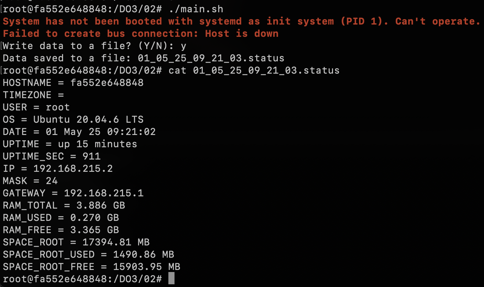
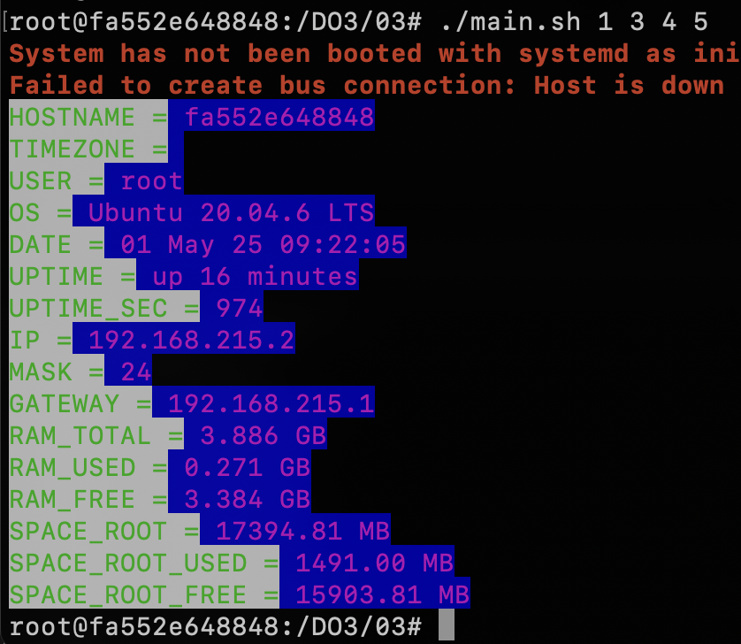
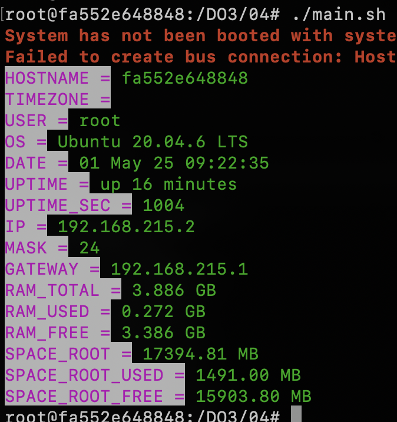
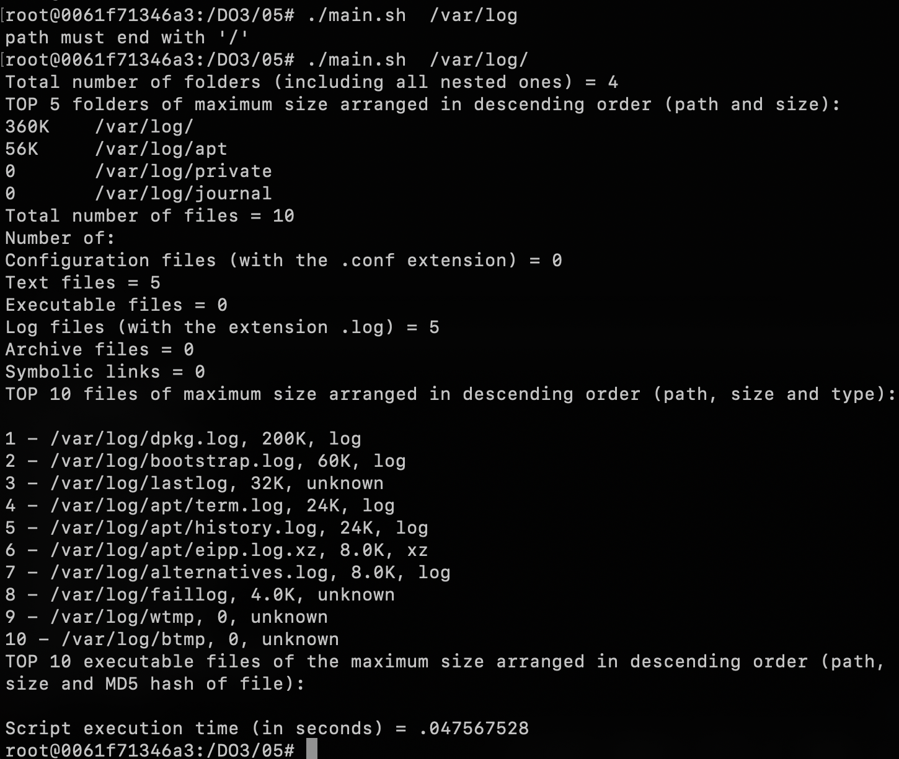

# Linux Monitoring v1.0

Скрипты запускаются через докер. `docker build -t do3 .`, `docker run -it do3 /bin/bash` \
Dockerfile:

```Dockerfile
FROM ubuntu:20.04

RUN apt-get update && \
    apt-get install -y systemd lsb-release iproute2 bc && \
    apt-get clean && \
    rm -rf /var/lib/apt/lists/*

WORKDIR /DO3

COPY . /DO3

RUN chmod +x */*.sh
```

## Part 1. Проба пера

Напиши bash-скрипт. Скрипт запускается с одним параметром. Параметр текстовый.  
Скрипт выводит значение параметра.  
Если параметр — число, то должно выводиться сообщение о некорректности ввода.


## Part 2. Исследование системы

Напиши bash-скрипт. Скрипт должен вывести на экран информацию в виде:

**HOSTNAME** = _сетевое имя_  
**TIMEZONE** = _временная зона в виде: **America/New_York UTC -5** (временная зона, должна браться из системы и быть корректной для текущего местоположения)_  
**USER** = _текущий пользователь, который запустил скрипт_  
**OS** = _тип и версия операционной системы_  
**DATE** = _текущее время в виде: **12 May 2020 12:24:36**_  
**UPTIME** = _время работы системы_  
**UPTIME_SEC** = _время работы системы в секундах_  
**IP** = _ip-адрес машины в любом из сетевых интерфейсов_  
**MASK** = _сетевая маска любого из сетевых интерфейсов в виде: **xxx.xxx.xxx.xxx**_  
**GATEWAY** = _ip шлюза по умолчанию_  
**RAM_TOTAL** = _размер оперативной памяти в Гб c точностью три знака после запятой в виде: **3.125 GB**_  
**RAM_USED** = _размер используемой памяти в Гб c точностью три знака после запятой_  
**RAM_FREE** = _размер свободной памяти в Гб c точностью три знака после запятой_  
**SPACE_ROOT** = _размер рутового раздела в Mб с точностью два знака после запятой в виде: **254.25 MB**_  
**SPACE_ROOT_USED** = _размер занятого пространства рутового раздела в Mб с точностью два знака после запятой_  
**SPACE_ROOT_FREE** = _размер свободного пространства рутового раздела в Mб с точностью два знака после запятой_

После вывода значений предложи записать данные в файл (предложить пользователю ответить **Y/N**).  
Ответы **Y** и **y** считаются положительными, все прочие — отрицательными.
При согласии пользователя в текущей директории пусть создается файл, содержащий информацию, которая была выведена на экран.  
Название файла должно иметь вид: **DD_MM_YY_HH_MM_SS.status** (Время в имени файла должно указывать момент сохранения данных).



## Part 3. Визуальное оформление вывода для скрипта исследования системы

Напиши bash-скрипт. За основу возьми скрипт из [**Part 2**](#part-2-исследование-системы) и убери из него часть, ответственную за сохранение данных в файл.
Скрипт запускается с 4 параметрами. Параметры числовые. От 1 до 6, например:  
`script03.sh 1 3 4 5`

Обозначения цветов: (1 — white, 2 — red, 3 — green, 4 — blue, 5 – purple, 6 — black)  
**Параметр 1** — это фон названий значений (HOSTNAME, TIMEZONE, USER и т. д.).  
**Параметр 2** — это цвет шрифта названий значений (HOSTNAME, TIMEZONE, USER и т. д.).  
**Параметр 3** — это фон значений (после знака '=').  
**Параметр 4** — это цвет шрифта значений (после знака '=').

Цвета шрифта и фона одного столбца не должны совпадать.  
При вводе совпадающих значений должно выводиться сообщение, описывающее проблему, и предложение повторно вызвать скрипт.  
После вывода сообщения программа должна корректно завершиться.



## Part 4. Конфигурирование визуального оформления вывода для скрипта исследования системы

Напиши bash-скрипт. За основу возьми скрипт из [**Part 3**]. Обозначения цветов аналогичные.  
Скрипт запускается без параметров. Параметры задаются в конфигурационном файле до запуска скрипта.  
Конфигурационный файл должен иметь вид:
```
column1_background=2
column1_font_color=4
column2_background=5
column2_font_color=1
```

Если один или несколько параметров не заданы в конфигурационном файле, то цвет должен подставляться из цветовой схемы, заданной по умолчанию.

После вывода информации о системе из [**Part 3**], нужно, сделав отступ в одну пустую строку, вывести цветовую схему в следующем виде:
```
Column 1 background = 2 (red)
Column 1 font color = 4 (blue)
Column 2 background = 5 (purple)
Column 2 font color = 1 (white)
```

При запуске скрипта с цветовой схемой по умолчанию вывод должен иметь вид:
```
Column 1 background = default (black)
Column 1 font color = default (white)
Column 2 background = default (red)
Column 2 font color = default (blue)
```



## Part 5. Исследование файловой системы

Напиши bash-скрипт. Скрипт запускается с одним параметром.  
Параметр — это абсолютный или относительный путь до какой-либо директории. Параметр должен заканчиваться знаком '/', например:  
`script05.sh /var/log/`

Скрипт должен выводить следующую информацию о каталоге, указанном в параметре:
- Общее число папок, включая вложенные;
- Топ-5 папок с самым большим весом в порядке убывания (путь и размер);
- Общее число файлов;
- Число конфигурационных файлов (с расширением .conf), текстовых файлов, исполняемых файлов, логов (файлов с расширением .log), архивов, символических ссылок;
- Топ-10 файлов с самым большим весом в порядке убывания (путь, размер и тип);
- Топ-10 исполняемых файлов с самым большим весом в порядке убывания (путь, размер и хеш);
- Время выполнения скрипта.

Скрипт должен вывести на экран информацию в виде:

```
Total number of folders (including all nested ones) = 6  
TOP 5 folders of maximum size arranged in descending order (path and size):  
1 - /var/log/one/, 100 GB  
2 - /var/log/two/, 100 MB  
etc up to 5
Total number of files = 30
Number of:  
Configuration files (with the .conf extension) = 1 
Text files = 10  
Executable files = 5
Log files (with the extension .log) = 2  
Archive files = 3  
Symbolic links = 4  
TOP 10 files of maximum size arranged in descending order (path, size and type):  
1 - /var/log/one/one.exe, 10 GB, exe  
2 - /var/log/two/two.log, 10 MB, log  
etc up to 10  
TOP 10 executable files of the maximum size arranged in descending order (path, size and MD5 hash of file):  
1 - /var/log/one/one.exe, 10 GB, 3abb17b66815bc7946cefe727737d295  
2 - /var/log/two/two.exe, 9 MB, 53c8fdfcbb60cf8e1a1ee90601cc8fe2  
etc up to 10  
Script execution time (in seconds) = 1.5
```

