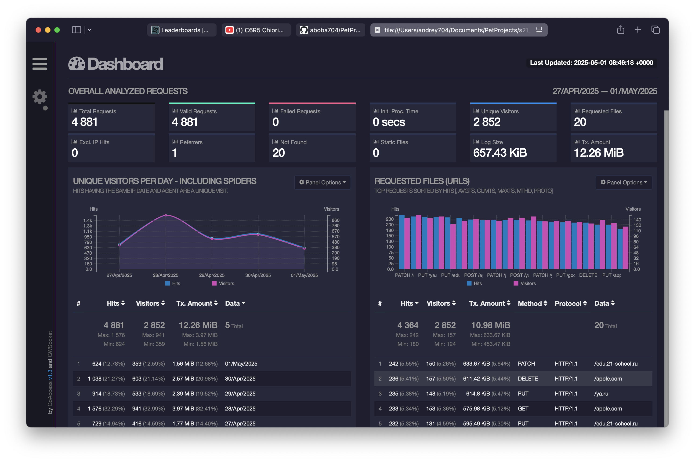
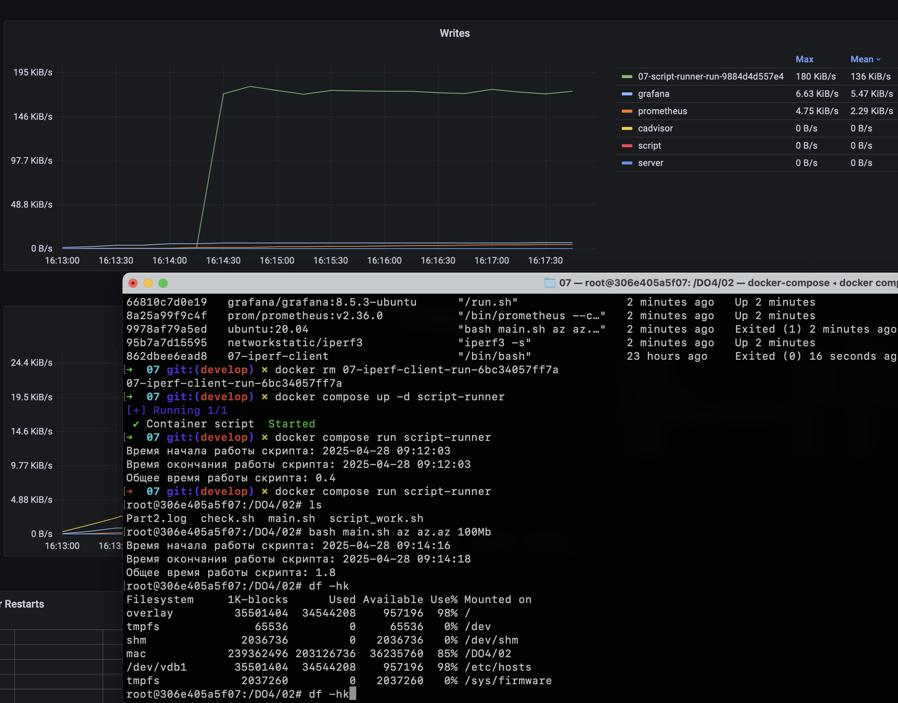
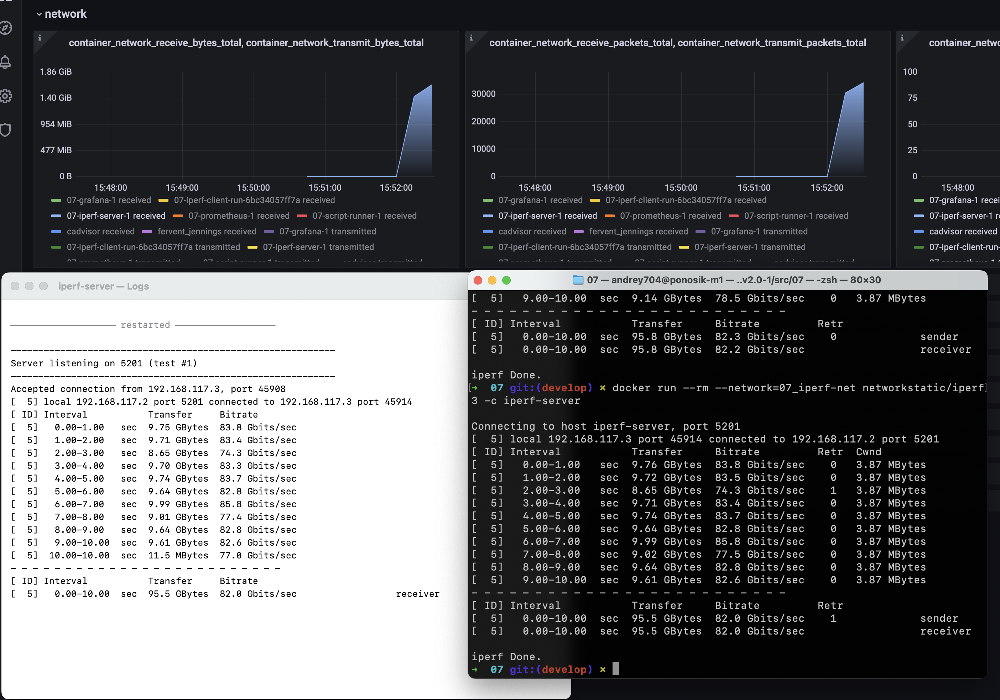
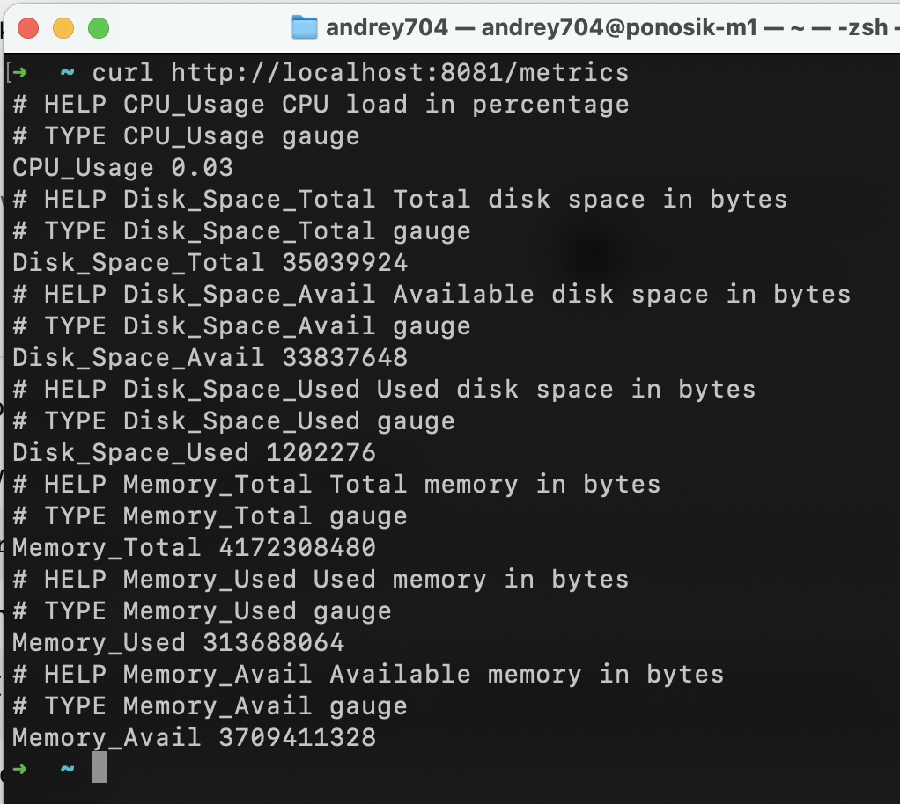

# Linux Monitoring

Скрпиты запускаются через `run.sh 1..6`, который вызывает *entrypoint.sh* внутри докер контейнера. \
7, 8, и 9 задачи запускаются через `docker-compose`

## Part 1. Генератор файлов. 

Написать скрипт создания файлов в директории. Сгенерировать лог с созданными папками/файлами. Пример запуска скрипта: \
`main.sh /opt/test 4 az 5 az.az 3kb`

**Параметр 1** — это абсолютный путь. \
**Параметр 2** — количество вложенных папок. \
**Параметр 3** — список букв английского алфавита, используемый в названии папок (не более 7 знаков). \
**Параметр 4** — количество файлов в каждой созданной папке. \
**Параметр 5** — список букв английского алфавита, используемый в имени файла и расширении (не более 7 знаков для имени, не более 3 знаков для расширения). \
**Параметр 6** — размер файлов (в килобайтах, но не более 100). \

Имена папок и файлов должны состоять только из букв, указанных в параметрах, и использовать каждую из них хотя бы один раз.  
Длина этой части имени должна быть от четырех знаков, плюс дата запуска скрипта в формате DDMMYY, отделённая нижним подчёркиванием, например: \
**./aaaz_021121/**, **./aaazzzz_021121** 

При этом если для имени папок или файлов были заданы символы `az`, то в названии файлов или папок не может быть обратной записи: \
**./zaaa_021121/**, т. е. порядок указанных символов в параметре должен сохраняться.

При запуске скрипта в месте, указанном в Параметре 1, должны быть созданы папки и файлы в них с соответствующими именами и размером.  
Скрипт должен остановить работу, если в файловой системе (в разделе /) останется 1 Гб свободного места.  
Запиши лог-файл с данными по всем созданным папкам и файлам (полный путь, дата создания, размер для файлов).

файлы: [01/](src/01/), [common/](src/common/)

## Part 2. Засорение файловой системы

Напиши bash-скрипт. Сгенерируй лог. Скрипт запускается с 3 параметрами. Пример запуска скрипта: \
`main.sh az az.az 3Mb`

**Параметр 1** — список букв английского алфавита, используемый в названии папок (не более 7 знаков). \
**Параметр 2** — список букв английского алфавита, используемый в имени файла и расширении (не более 7 знаков для имени, не более 3 знаков для расширения). \
**Параметр 3** — размер файла (в Мегабайтах, но не более 100).  

Имена папок и файлов должны состоять только из букв, указанных в параметрах, и использовать каждую из них хотя бы 1 раз.  
Длина этой части имени должна быть от 5 знаков, плюс дата запуска скрипта в формате DDMMYY, отделённая нижним подчёркиванием, например: \
**./aaazz_021121/**, **./aaazzzz_021121** 

При этом если для имени папок или файлов были заданы символы `az`, то в названии файлов или папок не может быть обратной записи: \
**./zaaa_021121/**, т. е. порядок указанных в параметре символов должен сохраняться.

При запуске скрипта в */home* должны быть созданы папки с файлами.
Количество вложенных папок — до 100. Количество файлов в каждой папке — случайное число (для каждой папки своё).  
Скрипт должен остановить работу, когда в файловой системе (в разделе /) останется 1 Гб свободного места.

Запиши лог-файл с данными по всем созданным папкам и файлам (полный путь, дата создания, размер для файлов).  
В конце работы скрипта выведи на экран время начала работы скрипта, время окончания и общее время его работы. Дополни этими данными лог-файл.


файлы: [02/](src/02/), [common/](src/common/)

## Part 3. Очистка файловой системы

Напиши bash-скрипт. Скрипт запускается с 1 параметром.
Скрипт должен уметь очистить систему от созданных в [Part 2] папок и файлов 3 способами:

1. По лог файлу
2. По дате и времени создания
3. По маске имени (т. е. символы, нижнее подчёркивание и дата).  

Способ очистки задается при запуске скрипта, как параметр со значением 1, 2 или 3.

При удалении по дате и времени создания пользователем вводятся времена начала и конца с точностью до минуты. Удаляются все файлы, созданные в указанном временном промежутке. Ввод может быть реализован как через параметры, так и во время выполнения программы.

файлы: [03/](src/03/)

## Part 4. Генератор логов

Напиши bash-скрипт, генерирующий 5 файлов логов **nginx** в *combined* формате.
Каждый лог должен содержать информацию за один день.

За день должно быть сгенерировано случайное число записей от 100 до 1000.
Для каждой записи должны случайным образом генерироваться:

1. IP (любые корректные, т. е. не должно быть ip вида 999.111.777.777)
2. Коды ответа (200, 201, 400, 401, 403, 404, 500, 501, 502, 503)
3. Методы (GET, POST, PUT, PATCH, DELETE)
4. Даты (в рамках заданного дня лога, должны идти по увеличению)
5. URL запроса агента
6. Агенты (Mozilla, Google Chrome, Opera, Safari, Internet Explorer, Microsoft Edge, Crawler and bot, Library and net tool)


файлы: [04/](src/04/)

## Part 5. Мониторинг

Напиши bash-скрипт для разбора логов **nginx** из [Части 4] через **awk**.

Скрипт запускается с 1 параметром, который принимает значение 1, 2, 3 или 4.
В зависимости от значения параметра выведи:

1. Все записи, отсортированные по коду ответа;
2. Все уникальные IP, встречающиеся в записях;
3. Все запросы с ошибками (код ответа — 4хх или 5хх);
4. Все уникальные IP, которые встречаются среди ошибочных запросов.

файлы: [05/](src/05/)

## Part 6. **GoAccess**

С помощью утилиты GoAccess получи ту же информацию, что и в [Части 5].

Открой веб-интерфейс утилиты на локальной машине.

`goaccess access.log -o report.html --log-format=COMBINED --real-time-html`



## Part 7. **Prometheus** и **Grafana**

Установи и настрой **Prometheus** и **Grafana** на виртуальную машину. \
Получи доступ к веб-интерфейсам **Prometheus** и **Grafana** с локальной машины.

Добавь на дашборд **Grafana** отображение ЦПУ, доступной оперативной памяти, свободное место и кол-во операций ввода/вывода на жестком диске.

#### Disk Usage: `container_fs_usage_bytes{id="/"}`
#### Memory Usage: `container_memory_usage_bytes{id="/"}`
#### CPU Usage: `rate(container_cpu_usage_seconds_total{id="/"}[5m])`
#### Disk Writes: `rate(container_fs_writes_bytes_total{device="/dev/vdb", id="/"}[5m])`


Запусти свой bash-скрипт из [Части 2]. Посмотри на нагрузку жесткого диска (место на диске и операции чтения/записи).


Установи утилиту **stress** и запусти команду `stress -c 2 -i 1 -m 1 --vm-bytes 32M -t 10s`. Посмотри на нагрузку жесткого диска, оперативной памяти и ЦПУ.


файлы: [07/](src/07/)

## Part 8. Готовый дашборд

Собственно, зачем составлять собственный дашборд, если, как говорится, «всё уже украдено до нас»?
Почему бы не взять готовый дашборд, на котором есть все нужные метрики?

Установи готовый дашборд с официального сайта **Grafana Labs**.

Проведи те же тесты, что и в [Части 7].

файлы: [08/](src/08/)



Запусти ещё одну виртуальную машину, находящуюся в одной сети с текущей. Запусти тест нагрузки сети с помощью утилиты **iperf3**. Посмотри на нагрузку сетевого интерфейса.



## Part 9. Дополнительно. Свой *node_exporter*

Напиши bash-скрипт, собирающие информацию по базовым метрикам системы (ЦПУ, оперативная память, жесткий диск (объем)).
Скрипт или программа должна формировать html страничку по формату **Prometheus**, которую будет отдавать **nginx**. \
Саму страничку обновлять можно как внутри bash-скрипта или программы (в цикле), так и при помощи утилиты cron, но не чаще, чем раз в 3 секунды.

```bash
#!/bin/bash

if [[ $# != 0 ]]; then
    echo "There should not be any parameters."
    exit 1;
else
    while true; do
        cpu=$(cat /proc/loadavg | awk '{print $1}')
        disk_space_total=$(df / | awk 'NR==2 {print $2}')
        disk_space_avail=$(df / | awk 'NR==2 {print $4}')
        disk_space_used=$(df / | awk 'NR==2 {print $3}')
        memory_total=$(free -b | awk 'NR==2 {print $2}')
        memory_avail=$(free -b | awk 'NR==2 {print $4}')
        memory_used=$(free -b | awk 'NR==2 {print $3}')

        metrics_html="# HELP CPU_Usage CPU load in percentage
# TYPE CPU_Usage gauge
CPU_Usage $cpu
# HELP Disk_Space_Total Total disk space in bytes
# TYPE Disk_Space_Total gauge
Disk_Space_Total $disk_space_total
# HELP Disk_Space_Avail Available disk space in bytes
# TYPE Disk_Space_Avail gauge
Disk_Space_Avail $disk_space_avail     
# HELP Disk_Space_Used Used disk space in bytes
# TYPE Disk_Space_Used gauge
Disk_Space_Used $disk_space_used
# HELP Memory_Total Total memory in bytes
# TYPE Memory_Total gauge
Memory_Total $memory_total
# HELP Memory_Used Used memory in bytes
# TYPE Memory_Used gauge
Memory_Used $memory_used
# HELP Memory_Avail Available memory in bytes
# TYPE Memory_Avail gauge
Memory_Avail $memory_avail" 

        echo "$metrics_html" > metrics/metrics.html

        sleep 3
    done
fi
```



Поменяй конфигурационный файл **Prometheus**, чтобы он собирал информацию с созданной тобой странички.

```yml
global:
  scrape_interval: 3s

scrape_configs:
  - job_name: 'metrics'
    static_configs:
      - targets: ['nginx:8081']
```


Проведи те же тесты, что и в [Части 7].


файлы: [09/](src/09/)